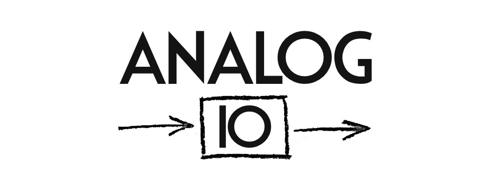

========
This is the repository for the webpage of Analog IO.  
The site should reflect the status of the finished and ongoing projects in Analog IO.  
Contributors should also be able to create new projects that the members of Analog IO should solve.

